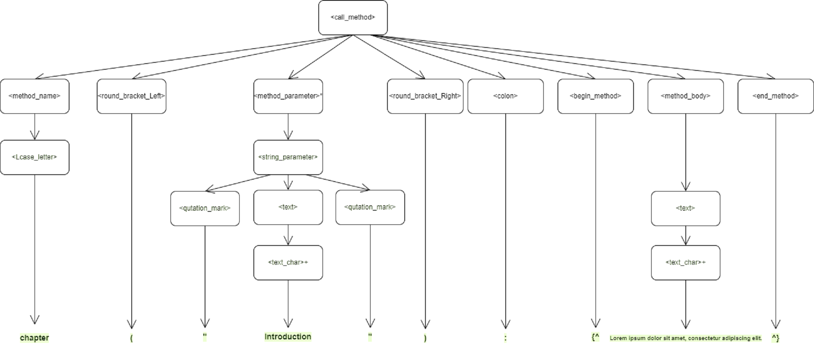

<p align="center">
  <a>
    
  </a>
</p>

</br>

## Document Preparation System Parser

This is a Proof-of-Concept of a DSL for Document Preparation System parser. This is still WIP. DSL is being parsed using LARK and described in EBNF.

</br>

## Semantic Rules

To avoid receiving errors, a set of rules will be declared : 
* The method for creating a document should always have the parameters of the file type and extension for the file.
* A method for creating a chapter should be inside the method for creating the document.
* A method for creating a subchapter should be inside the method for creating a chapter.
* Methods for creating chapters and subchapters should have titles written into the parameters.
* The method that references the image should have the same title string as the method that adds the image to the document.
* A method should be called using lowercase letters.
* Strings should be written in quotations.

</br>

***

</br>

<p align="center">
  <a>
    
  </a>
</p>

<div align="center">
    <h4>Derivation tree for writing a chapter</h4>
    <br />
</div>

## Usage

```
python main.py
```

## TODOs

* Output AST as JSON or other usable format instead of STDOUT